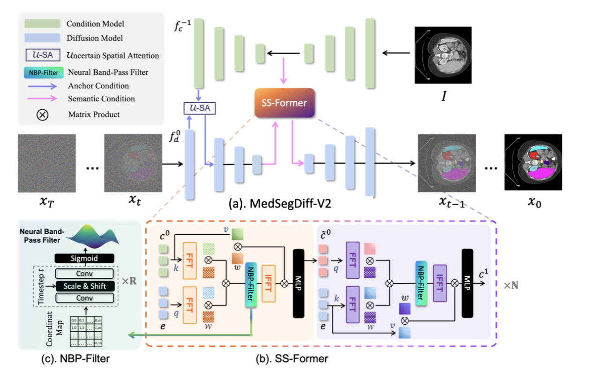
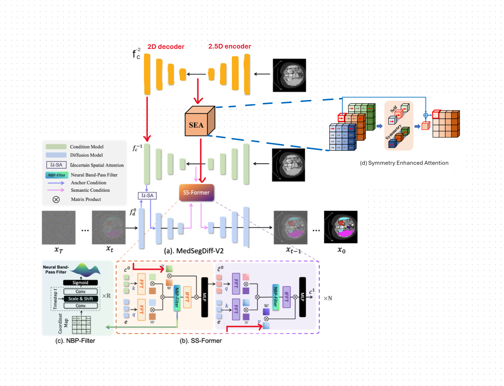

# MedDiffSeg (Under Construction)

> **IMPORTANT NOTE**
>
> This is a **temporary** repository. This project is currently under active development and construction.

## Purpose

This repository is being created with the goal of comprehensively upgrading and improving upon the original **MedSegDiff** version.

The original repository can be found here:
[MedSegDiff](https://github.com/ImprintLab/MedSegDiff)

## Comparison (Work in Progress)

The table below illustrates the (planned) differences between the original version and this new, upgraded version.

| MedSegDiff (Original Version) | MedDiffSeg (New Version) |
| :---: | :---: |
| **[ImprintLab/MedSegDiff](https://github.com/ImprintLab/MedSegDiff)** | **New Project (MedDiffSeg)** |
|  |  |

- For training, run: 
```
!python scripts/segmentation_train.py \
  --data_dir directory_path \
  --out_dir directory_path \
  --image_size 256 \
  --num_channels 128 \
  --class_cond False \
  --num_res_blocks 2 \
  --num_heads 1 \
  --learn_sigma True \
  --use_scale_shift_norm False \
  --attention_resolutions 16 \
  --diffusion_steps 1000 \
  --noise_schedule linear \
  --rescale_learned_sigmas False \
  --rescale_timesteps False \
  --lr 1e-4 \
  --batch_size 16 \
  --log_interval 50 \
  --save_interval 1000 \
  --lr_anneal_steps 100000
```

- For testing, run:
```
PYTORCH_CUDA_ALLOC_CONF=expandable_segments:True CUDA_VISIBLE_DEVICES=1 python scripts/segmentation_sample.py \
  --data_name BRATS3D \
  --data_dir /mnt/sda1/MedDiffSeg_GPU/training_test \
  --out_dir /mnt/sda1/MedDiffSeg_GPU/output \
  --model_path /mnt/sda1/MedDiffSeg_GPU/emasavedmodel_0.9999_100000.pt \
  --image_size 256 \
  --num_channels 128 \
  --class_cond False \
  --num_res_blocks 2 \
  --num_heads 1 \
  --learn_sigma True \
  --use_scale_shift_norm False \
  --attention_resolutions 16 \
  --diffusion_steps 1000 \
  --noise_schedule linear \
  --rescale_learned_sigmas False \
  --rescale_timesteps False \
  --num_ensemble 5 \
  --batch_size 1 \
  --gpu_dev 0 \
  --debug True \
  --version medsegdiff-v2 \
  --in_ch 5 \
  --use_fp16 True
```

---
Kaggle data link: [Brats 2021](https://www.kaggle.com/datasets/hoangtung719/brats2021-data)

*Please check back later for detailed updates. Thank you for your patience!*
